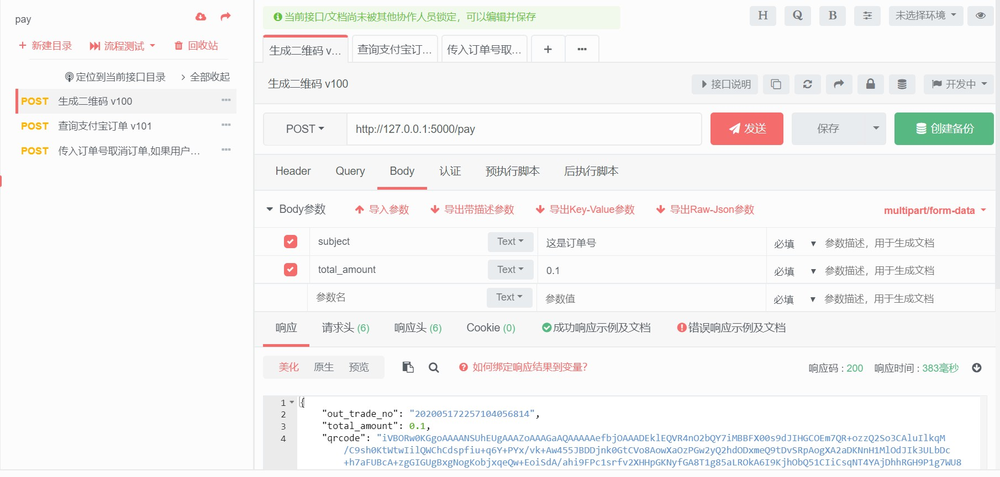

> BPay个人收款支付系统:当前开源版本v1.0 [点我获取最新源码及文档](https://pay.baoapi.com/)

### BPay 简介

BPay
支持支付宝资金直接到达本人账号，官方通道自动回调，免签通道个人移动端一键审核即时回调，不需提现，不需备案，完全免费，不干涉监听任何支付数据，个人收款0风险方案（前提是每月收款不超过150万人民币,在支付宝后台开发中心提交营业执照后不限收款额度）
结论：稳定安全可靠

### 项目已部署，在线Demo
本项目运行后效果：[https://pay.baoapi.com](https://pay.baoapi.com/)

### 商业线上版本已发布！支付宝官方接口 自动回调！[立即获取源码和文档](https://pay.baoapi.com/)

### 获取源码后个人调用封装后的原生支付宝支付接口

### 市面上个人收款项目
 * 支付宝微信只服务于有营业执照、个体工商户的商户。截止目前（2020-01-01）无法以个人身份（或以个人为主体）直接申请API。

> * 结论：不可行

 * 关联企业支付宝账号

> * 即新建企业账户，然后采用已经实名认证了的企业账户关联该账户，用其实名主体完成新账户的实名认证。一系列操作完成后，新的账户具有和企业账户一样的资质可以申请API。

> *  结论：如果条件允许，推荐此方案

 * 聚合支付工具，Ping++等

> * 就是个第四方聚合支付工具，简化了接入开发流程而已，个人开发者仍然需要去申请所需接口的使用权限。

> * 结论：不可行

 * 第四方聚合支付

> * 支付资金进入官方账号，自己再进行提现操作。需要开通域名，提现手续费较高，支付页面不支持自定义。另外，对于此种类型的聚合支付平台，隐藏着极高的跑路风险。

> * 结论：不推荐

 * 有赞

> * 通过有赞微商城支付接口收款。
> * 结论：不推荐，需手动提现，不免费，费用6800/年起，一旦风控资金很难取出。
借助拼多多店铺、淘宝代付功能、微博红包、钉钉红包等第三方APP的支付功能

> * 结论：不推荐，可能随时被风控。

 * 挂机监听软件，PaysApi、绿点支付等

> * 本质上依然是采用挂机监听的策略，但针对的是移动端支付宝或微信的收款通知消息
结论：成本高，配置麻烦，需24小时挂台安卓手机，不免费
其他基于Xposed挂机监听软件

 * 基于virtual xposed hook相关技术，可自动生成任意备注金额收款码 参考抢红包外挂
> * 结论：成本高，配置麻烦，需24小时挂台安卓手机，量大易触发风控、不免费，黑产适用
Payjs （疑使用微信小微商户）

> * 结论：仅支持微信、不免费、使用官方接口收取代开费用以及额外手续费
国外支付，PayPal、Strip：不可用
